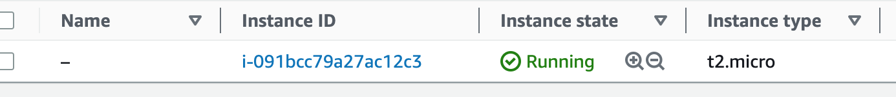

# Terraform
### Working with Terraform
1. First thing to do on the Cli is to link your AWS account to your CLI
- After creating a user on AWS & adding it to your user group
- Ensure you give it the right permission
> 

2. Then use this command on the CLI after going to the directive to autheticate teraform
- `aws configure` *Create a new access key from AWS then put as required*
- Go to the directive
- `terraform init` *To log into terraform from your ClI(initializes the project)*
- `terraform plan` *To find the sequence of things that need to happen*
- `terraform apply` *it's the next thing to make it running*
> 
- `terraform destroy` *to clear it and stop it*

3. Create the S3 bucket & Dyanamo DB on account
- Go into the backend directive and use `terraform init` *this is after using `terraform apply`

## How to consume a third party module $ deploying a consul module 
- after going to the directory and using `terraform init`, `terraform plan` 
- you might need to watch the resource part and all but that's it
